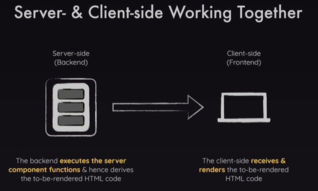

# Nextjs

- It is fullstack react framework
- File based routing: Routes are configured via filesystem (files or folders)
- Server side rendering: By default all pages are rendered on server & then sent to client; Adv: finished HTML page is sent to client (great for SEO)
- Nextjs is both server side & client side
- 

# Server side vs Client side

- SSR
  - Server-side processing involves operations and logic executed on a web server before the results are sent to the client's browser.
  - Data Security: More secure since the server controls the data processing and storage.
  - Performance: Can handle heavy processing tasks
  - SEO: Better for SEO as the content is fully rendered on the server before being sent to the client
  - Page Load: Typically slower initial page load because the server needs to process and render the page before sending it to the client.
  - State Management: Easier to manage state since it resides on the server, which can maintain session information and interact with databases directly
- CSR
  - Client-side processing involves operations and logic executed in the user's browser after the web page has been delivered by the server.
  - Data Security: Less secure as the code is visible to the user and can be manipulated.
  - Performance: Can lead to faster interactions after the initial load, as subsequent actions don't require a server round-trip.
  - SEO: More challenging for SEO because content is rendered dynamically in the browser; search engines may not index the content correctly without additional setup (e.g., server-side rendering or pre-rendering).
  - Page Load: Faster subsequent interactions but potentially slower initial load if large JavaScript files need to be downloaded.
  - State Management: Managed within the browser using tools like Redux, Context API, or local storage, which can be more complex.

# Reserved File names

- page.js => Create a new page (e.g., app/about/page.js creates a <our-domain>/about page)
- layout.js => Create a new layout that wraps sibling and nested pages
- not-found.js => Fallback page for "Not Found" errors (thrown by sibling or nested pages or layouts)
- error.js => Fallback page for other errors (thrown by sibling pages or nested pages or layouts)
- loading.js => Fallback page which is shown whilst sibling or nested pages (or layouts) are fetching data
- route.js => Allows us to create an API route (i.e., a page which does NOT return JSX code but instead data, e.g., in the JSON format)
- icon.png is used as favicon
- https://nextjs.org/docs/app/api-reference/file-conventions

# Dynamic Routes

- [id] folder -> page.tsx; can use it as params.id, params can be destructured from component prop

# Foodies-Next

Basics of Next.js(App router)

- better-sqlite3: DB used
- slugify: to create a slug
- xss: to protect from cross site scripting attacks
